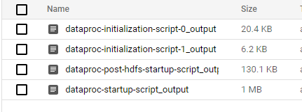

# Apache-Drill-On-GCP-Dataproc

*This repository describes to provision apache drill with zookeeper in GCP dataproc with automation*

**Prerequisites:**
---
Before you install Drill on nodes in a cluster, Ensure that the cluster meets the following prerequisites:

  * (Required) Image: Ubuntu 18.04 LTS, Hadoop 3.2, Spark 3.1      
  * (Required) Running a [ZooKeeper quorum](https://zookeeper.apache.org/doc/r3.1.2/zookeeperStarted.html#sc_RunningReplicatedZooKeeper)
  * (Required) Firewalls ports to be opened as per google recommended on the vpc/subnet [Dataproc Cluster Network Configuration](https://cloud.google.com/dataproc/docs/concepts/configuring-clusters/network)
  * (Recommended) 1 master node with 2 worker nodes
  * (Recommended) To install these prerequisites using Initialization action scripts
  * (Recommended) minimum machine-type:  n1-standard-2 

**Configuration**
---
 

 + To Install Drill With Multi Node Cluster In Distributed Mode Using *apache-drill.sh script*
 + To install ZooKeeper quorum in GCP dataproc Using *zookeeper_quorum.sh*
 + Dataproc Cluster Provison Using *automation.sh script* 

  **How to use:**
---

 1. Update the drill version in *apache-drill.sh*
 2. Update the ZooKeeper version in *zookeeper_quorum.sh*
 3. Upload both scripts to gcs bucket and add the path in automation.sh
 4. Run `gcloud auth login` and authenticate yourself to the gcp project
 5. Run `bash  automation.sh` 

 Note : It will take around 10+ mins to provision the dataproc cluster

**How to Contribute**
---

1. Clone repo and create a new branch: `$ git checkout https://github.com/mohamedkashifuddin/apache-drill-on-gcp-dataproc -b name_for_new_branch`.
2. Make changes and test
3. Submit Pull Request with comprehensive description of changes

  **Disclaimer:**
---

 + These scripts belongs to Repo: [GoogleCloudDataproc/initialization-actions](https://github.com/GoogleCloudDataproc/initialization-actions), I have modified according to my use-case

  **Validation:**
---
 + You will have dataproc stageing bucket, Each node with indivial folders and each folder will have 4 scripts in as example in below image 

 

